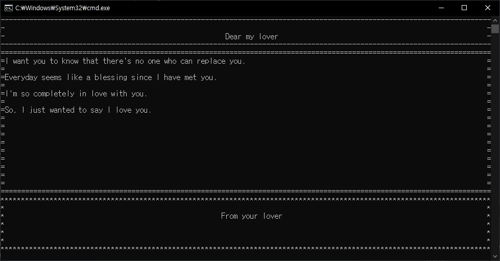

Perfume Guide & Example
======================

# Example

## 1. Loveletter.go

모든 formal과 free, stack layout을 사용하여 구현합니다.  
# Guide
## 0. Window 구조 Format Tree 뷰어
--------------------
<details>
<summary style="font-size:15pt"> 열어서 확인하세요.</summary>

```
window := NewWindow(NewSize(32, 80))
body := NewBody(NewSize(32, 80), "MainBody")
stack := NewLayout(StackLayoutType,"MyLayout")
input := NewElement(InputElementType, "MyInput", NewRelativeLocation(5, 10))

_ = body.AddChild(stack)
_ = stack.AddChild(input)
_ = window.Add(body)

renderer := NewRenderer(window)

renderer.PrintStruct(ElementsPrintDepth, map[PrintLineForm]*Parseable{
	WindowLine:   NewParseable("Window || (%Size%) || (%ChildrenLen%) ||\n\n"),
	FormalsLine:  NewParseable("-- (%Name%) Formal --\n"),
	LayoutsLine:  NewParseable("\t└--(%Type%)layout %Name%\n"),
	ElementsLine: NewParseable("\t\t└--(%Type%)element LOC:%RelLocation%\n"),
})
```  
위와 같은 코드로 Renderer를 만든 후,  
PrintStruct함수로 Window와 그 하위 객체들에 대한 그림을 그리나, %PROPERTY%로 묶은 문자열로, 자율적으로 출력(Printing) 방법을 고칠 수 있습니다.   
더 자세한 부분은 <span style="font-weight:bold;color:#003f69">parser.go</span> 의 PrintPropertyType를 봐주세요.

</details>

## 1.구조
--------------  

퍼퓸은 총 4개의 엘리먼트(Element)들로 이루어져 있습니다.  
상위 엘리먼트부터 나열하자면 Window, Formal,Layout, Element가 있습니다.  

## 특징
------------
<details>
<summary style="font-size:15pt"> 특징 1~4번 </summary>

1. ### Window 엘리먼트는 형식이 1개입니다.  
---
절대로 변경될 수 없으며, 빌더(Builder) 역할을 합니다.  
Window에는 Children이 있는데, 그것들은 모두 IFormal입니다.  

2. ### Formal 엘리먼트는 Window보다 작거나 같아야합니다.  
---
Formal 엘리먼트는 ILayout들만을 Children으로 가집니다.  

3. ### Layout 엘리먼트는 2가지 입니다.  
----

첫째, 스택 레이아웃  
이것은 자식의 RelativeLocation 속성을 무력화시킵니다.  
자신의 Orientation 속성에 따라서 가로, 세로 스택의 형태만 가집니다.  

둘째, 프리 레이아웃
이것은 자식의 RelativeLocation 속성을 고려해 자식의 위치를 정합니다. 그 외 특별한 속성은 존재 하지 않습니다.  

셋째, 부모 엘리먼트로써 IFormal을 가지며, 자식 엘리먼트를 IElement의 형태로 가집니다.

4. ### Element 엘리먼트
----

부모 엘리먼트로 ILayout을 가지며 다양한 속성이 적용 될 수 있고, 가장 많이 커스텀 엘리먼트가 발생될 수 있습니다.

</details>  

<details>
<summary style="font-size:15pt"> 특징 5번 - 인터페이스 </summary>

5. ### 인터페이스 IFormal, ILayout, IElement
-----
이것 외에 iFormalElement, iLayoutElement, iElement등이 존재하는데, 이것은 구조체 FormalElement, LayoutElement, Element의 인터페이스 들입니다.  
 그리고 이 구조체들은 FreeLayout, Input 등의 엘리먼트들의 필수요소가 됩니다.   
> 즉, Head 구조체에는 FormalElement가 있는데, FormalElement는 iFormalElement를 따르니까, iFormalELement 형식의 변수에 Head의 FormalElement(Head.FormalElement입니다. Head가 아닙니다!)가 들어갈 수 있습니다. 그런데 이렇게 하면 각 커스텀 엘리먼트들이나 Input, Text와 같은 엘리먼트들에 특성을 부여하기 매우 어렵습니다. 그래서 ILayout과 IFormal, IElement와 같이 iFormal .. iLayout ... iElement 의 필수 함수들을 구현한것을 포함하는 새로운 인터페이스를 만들었습니다. 이렇게 한다면, Input 과 같은 구조체에 따로 InputStyles와 같은 함수 등을 추가 하여도, IElement형식의 변수에 저장이 가능합니다.    

>> 결론적으로, 소문자 i 로 시작하는 인터페이스들은 모든 엘리먼트들이 기본으로 갖춰야 할 것들을 선언하며, LayoutElement, Element, FormalElement들은 이것들을 구현하고 있습니다. 따라서 우리는, 커스텀 엘리먼트를 생성할때 원하는 엘리먼트에 따라 코드 구현이 가능합니다.
```
type Input struct {
	kind InputType
    //불러온 Element구조체가 이미 iElement인터페이스의 필수 함수들을 모두 구현한 상태입니다.
	Element
}
```
>>위 코드 처럼 Input 구조체를 구현 하며 Element 규칙을 따를 수 있습니다.

type.go에서  ~ElementType의 상수들의 구조체를 매개변수로 받고싶을땐, IFormal, ILayout, IElement 인터페이스를 사용하여 받을 수 있습니다.
마지막으로 쉽게 말해 구조체와 인터페이스들은 아래와 같이 대응됩니다.
```
FormalElement -> iFormalElement
LayoutElement -> iLayoutElement
Element -> iElement

//IFormal을 구현한 것은 필연적으로 iFormalElement를 구현합니다
IFormal -> iFormalElement

ex)
Footer == IFormal                      // true
Footer.FormalElement == iFormalElement // true
```

</details>

## 3. 프린트 버퍼 (PrintBuffer.go)
-------------------

프린트 버퍼는 렌더러를 도울 목적으로 설계되었으며, 터미널(terminal)에 출력할 글자들을 1차원 평문으로 저장합니다.  
``` SetColumn(...),  SetRow(...) ``` 와 같은 함수들이 포함되어있으며, ``` GetChanges ``` 함수로 변경 부분들만 따로 골라낼 수 있습니다.

### pattern 매개변수

말 그대로 패턴입니다. 길이 10 엘리먼트가 있을때, 패턴 값이 "123"이라면, 결론적으로 "1231231231" 이러한 값이 됩니다.

### 매개변수 주의
- GetRow, Column 함수의 start, end 매개변수는 처음, 마지막 부분을 의미합니다.
- 고로 0이 시작이며, Width가 10일때 10이 마지막입니다.
- row, col 매개변수는 실제 위치를 나타냄으로 -1을 해주셔야합니다.

#### 예문 - 사각형
``` Go
border := "*"  
_ = printBuffer.SetRow(border, 0, 0, size.Width)
_ = printBuffer.SetRow(border, size.Height-1, 0, size.Width)
_ = printBuffer.SetColumn(border, 0, 0, size.Height)
_ = printBuffer.SetColumn(border, size.Width-1, 0, size.Height)
```

### 결과 - 사각형
```
********************************
*                              *
*                              *
*                              *
********************************
```

## 4. 렌더러 (Renderer.go)
-------------------

속성과 옵션을 렌더링 합니다.
```
renderer.PrintStruct(ElementsPrintDepth, map[PrintLineForm]*Parseable{
	WindowLine:   NewParseable("Window || (%Size%) || (%ChildrenLen%) ||\n\n"),
	FormalsLine:  NewParseable("-- (%Name%) Formal --\n"),
	LayoutsLine:  NewParseable("\t└--(%Type%)layout %Name%\n"),
	ElementsLine: NewParseable("\t\t└--(%Type%)element LOC:%RelLocation%\n"),
})
```
위 PrintStruct 함수로 tree 형으로써 자유로운 포맷의 구조를 출력할 수 있습니다.

```applyElementProperties``` 함수와 ```applyStyleOptions``` 함수가 모든 옵션과 스타일 적용을 도맡습니다.  

최종 출력은 ```fmt.Printf```함수로 행합니다.

## 5. 옵션 (Option.go) 

옵션은 말 그대로 엘리먼트(element)의 옵션입니다.  
```CreateOption``` 함수를 통해 생성할 수 있습니다.  
옵션의 ```Set```, ```Get``` 내부 함수들은 ```SetSettingFunc```, ```SetReturnFunc``` 함수로 설정 가능하며, 이것은 C#의 Property와 비슷합니다.  

### 주의
-----------
옵션의 Set으로 설정된 어떠한 '값'들은, 다른 엘리먼트들에게 넘겨질때 주소를 전달하기 때문에, 아래와 같은 코드일때 의도한 대로  
각기다른 border로 작동하지 않습니다.  
``` Go
borderOpt.Set("*")
body.AddOption(
	BorderOption,
	borderOpt,
)
borderOpt.Set("-")
head.AddOption(
	BorderOption,
	borderOpt,
)
borderOpt.Set("=")
foot.AddOption(
	BorderOption,
	borderOpt,
)
```

```Clone```함수를 통해 해결할 수 있습니다.
``` Go
borderOpt.Set("*")
body.AddOption(
	BorderOption,
	borderOpt.Clone(),
)
borderOpt.Set("-")
head.AddOption(
	BorderOption,
	borderOpt.Clone(),
)
borderOpt.Set("=")
foot.AddOption(
	BorderOption,
	borderOpt.Clone(),
)
```

## 6. 추후 개발 가이드
----------------
1. 모든 엘리먼트(Formal,Layout 등)은 이름을 가져야 합니다  

2. 자식으로 속해있을때 그들 중에 중복된 이름을 가져선 안됩니다.  

3. 읽을땐 무조건 부모 -> 자식 순으로 읽습니다.

4. static한 부분일 경우, renderer에서 confirm, clear, render 부분을 한번만 수행합니다. (loop에 들어가지 않습니다)
